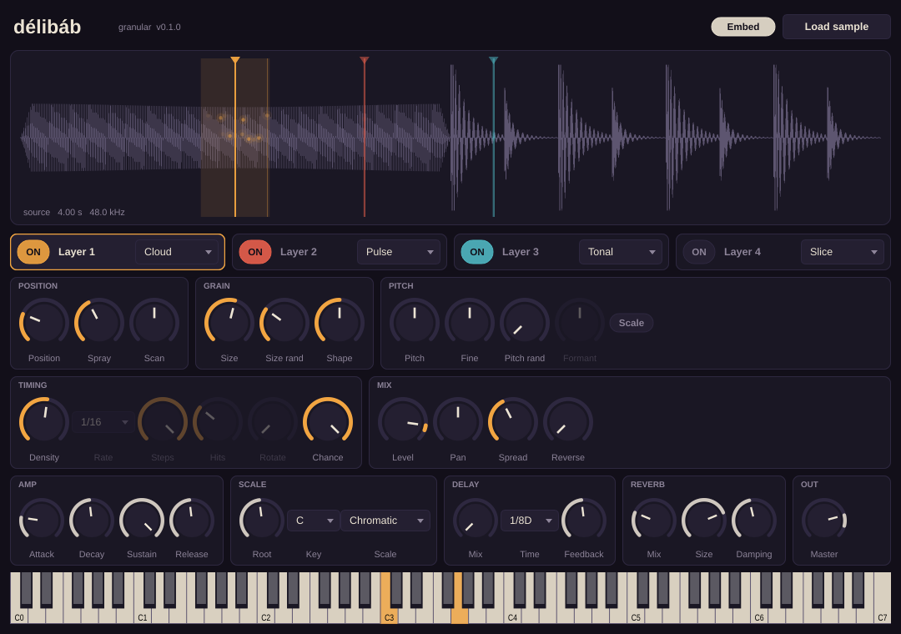

# délibáb

A granular synthesizer that turns any audio file into soundscapes, rhythms,
leads, pads and arpeggios. VST3 / AU / CLAP / Standalone for macOS (universal)
and Windows, built with [JUCE](https://juce.com).

*Délibáb* is Hungarian for the mirage that shimmers over the Great Plain on hot
days: a sound made of fragments that seems to hang in the air.



## What it does (v0.1)

- **4 grain layers**, each with its own mode:
  - **Cloud**: classic asynchronous granular clouds (density, size, spray, scan).
  - **Pulse**: grains on a tempo-synced Euclidean grid (rate, steps, hits, rotate, chance).
  - **Slice**: like Pulse, but grains snap to transients detected in the sample.
  - **Tonal**: audio-rate grain triggering, so the *grain rate* sets the pitch and
    the sample becomes a playable oscillator; *Formant* shifts the timbre.
- Per-grain randomness for size, pitch (optionally locked to a scale), pan and reverse.
- 16-voice polyphony, amp envelope, sustain pedal.
- Tempo-synced delay, reverb, safety limiter.
- Sample is analysed on load (waveform overview, transients) and can be
  embedded in the DAW project as FLAC.
- Every parameter is automatable, with stable IDs (see `src/Parameters.h`).
- Live grain particles on the waveform.

## Building

Requirements: CMake 3.22+, a C++20 compiler (Xcode 15+, Visual Studio 2022,
GCC 11+/Clang 14+). JUCE and the CLAP extensions are downloaded automatically.

```
cmake -B build -DCMAKE_BUILD_TYPE=Release
cmake --build build --config Release --parallel
```

macOS universal binary: add `-DCMAKE_OSX_ARCHITECTURES="arm64;x86_64"`.
Linux needs the [JUCE Linux dependencies](https://github.com/juce-framework/JUCE/blob/master/docs/Linux%20Dependencies.md).

Built plugins land in `build/Delibab_artefacts/Release/`.

### Tests

`DelibabTests` renders every mode offline to WAV, checks pitch accuracy, tempo
sync, state save/restore (incl. embedded samples), CPU headroom and that the
editor draws:

```
cmake --build build --target DelibabTests
./build/DelibabTests_artefacts/Release/DelibabTests test-output
```

Every push to `main` builds macOS and Windows plugins on GitHub Actions, runs
the tests and validates with [pluginval](https://github.com/Tracktion/pluginval)
(and `auval` for the AU). Download the builds from the run's **Artifacts**.
Pushing a tag like `v0.1.0` publishes a GitHub Release.

## Layout

```
src/
  Parameters.*        the parameter pool (IDs are permanent, read the rules)
  PluginProcessor.*   audio entry point, MIDI, state, sample hand-off
  PluginEditor.*      window, layout, file loading
  dsp/GrainEngine.*   voices, grain scheduling and rendering
  dsp/SampleData.*    loading, analysis (overview, transients), FLAC embedding
  dsp/Effects.*       delay, output limiter
  dsp/Scales.h        scale quantisation
  ui/                 look and feel, waveform view, layer and global panels
tests/TestMain.cpp    headless test and render tool
```

## Licence

Built on JUCE 9 (used under the JUCE licence's free Starter tier for now).
